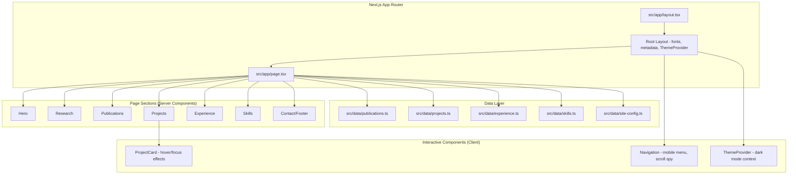

# Design Document: Academic Website

## Overview

This design describes a single-page academic personal website for Muhammad Saad Ali, built with Next.js 16 (App Router), React 19, Tailwind CSS 4, and TypeScript. The site follows a "Clean Minimal" aesthetic inspired by pascalmichaillat.org — white backgrounds, clean sans-serif typography (Inter/Source Sans Pro), generous whitespace, and minimal color accents (deep navy/slate).

The website is a statically-rendered single page with smooth-scroll navigation across sections: Hero/About, Research, Publications, Projects, Experience, Skills, and Contact. It includes a downloadable CV, dark mode toggle with localStorage persistence, responsive design across all viewports, structured data for SEO, and full accessibility compliance.

### Key Design Decisions

1. **Static Site Generation (SSG)**: All content is hardcoded in TypeScript data files — no CMS or database. This maximizes performance (sub-2s LCP) and simplifies deployment.
2. **Server Components by default**: The page and all section components are React Server Components. Only interactive elements (navigation toggle, dark mode toggle, scroll behavior) use Client Components.
3. **Tailwind CSS 4 with CSS custom properties**: Theme tokens (colors, spacing, typography scale) are defined as CSS custom properties in `globals.css` and consumed via Tailwind utilities. Dark mode uses the `class` strategy with a `ThemeProvider` client component.
4. **Single-page architecture**: All sections render on one page (`/`). Navigation uses anchor links with `scroll-behavior: smooth`.

## Architecture



### Rendering Strategy

- **Build-time static generation**: The entire site is pre-rendered at build time. No server-side data fetching at request time.
- **Client hydration**: Only interactive components (`Navigation`, `ThemeProvider`, `ProjectCard`) hydrate on the client.
- **Font optimization**: Inter and Source Sans Pro loaded via `next/font/google` with `display: swap` for zero layout shift.

## Components and Interfaces

### File Structure

```
src/
├── app/
│   ├── layout.tsx          # Root layout (html, body, fonts, metadata)
│   ├── page.tsx            # Main page composing all sections
│   ├── globals.css         # Tailwind import + CSS custom properties
│   └── _components/
│       ├── Navigation.tsx      # Client: sticky nav, mobile menu, scroll
│       ├── ThemeProvider.tsx   # Client: dark mode context + toggle
│       ├── ThemeToggle.tsx     # Client: dark/light switch button
│       ├── Hero.tsx            # Server: name, photo, tagline, links
│       ├── Research.tsx        # Server: research interests
│       ├── Publications.tsx    # Server: publication list
│       ├── Projects.tsx        # Server: project grid
│       ├── ProjectCard.tsx     # Client: hover/focus interaction
│       ├── Experience.tsx      # Server: timeline layout
│       ├── Skills.tsx          # Server: categorized skill tags
│       ├── Contact.tsx         # Server: footer with contact info
│       ├── SkipToContent.tsx   # Server: accessibility skip link
│       └── CVDownloadButton.tsx # Server: download link
├── data/
│   ├── site-config.ts     # Name, title, links, meta info
│   ├── publications.ts    # Publication entries
│   ├── projects.ts        # Project entries
│   ├── experience.ts      # Experience + education entries
│   └── skills.ts          # Skill categories and items
└── types/
    └── index.ts            # Shared TypeScript interfaces
```

### Component Interfaces

```typescript
// src/types/index.ts

export interface Publication {
  id: string;
  title: string;
  authors: string[];
  venue?: string;
  year: number;
  status: 'published' | 'under-review';
  link?: string;
}

export interface Project {
  id: string;
  title: string;
  description: string; // max 200 chars
  startDate: string;   // YYYY-MM format
  endDate: string;     // YYYY-MM format or "Present"
}

export interface ExperienceEntry {
  id: string;
  title: string;
  organization: string;
  startDate: string;
  endDate: string; // or "Present"
  type: 'work' | 'education';
}

export interface EducationEntry {
  id: string;
  degree: string;
  institution: string;
  startDate: string;
  endDate: string;
}

export interface SkillCategory {
  id: string;
  name: string;
  skills: string[];
}

export interface SiteConfig {
  name: string;
  title: string;
  affiliation: string;
  tagline: string; // max 150 chars
  email: string;
  linkedIn: string;
  github: string;
  photoPath: string;
  cvPath: string;
  metaTitle: string;       // max 60 chars
  metaDescription: string; // max 160 chars
  siteUrl: string;
}
```

### Key Component Contracts

**Navigation (Client Component)**
- Props: none (reads section IDs from DOM)
- State: `isMenuOpen: boolean`, `activeSection: string`
- Behavior: Fixed position, collapses to hamburger at <768px, smooth scroll on link click, focus trap when mobile menu open

**ThemeProvider (Client Component)**
- Props: `children: React.ReactNode`
- State: `theme: 'light' | 'dark'`
- Behavior: Reads initial theme from `localStorage`, applies `dark` class to `<html>`, persists changes to `localStorage`

**Hero (Server Component)**
- Props: none (imports from `site-config.ts`)
- Renders: Name, title, affiliation, photo (Next.js `<Image>` at max 400x400), tagline, contact icons, CV download button

**Publications (Server Component)**
- Props: none (imports from `publications.ts`)
- Renders: List sorted by year descending, with status badges, conditional venue display

**Projects (Server Component)**
- Props: none (imports from `projects.ts`)
- Renders: Grid of `ProjectCard` components sorted by end date descending

**ProjectCard (Client Component)**
- Props: `project: Project`
- Behavior: Hover scale/elevation effect, same effect on keyboard focus

## Data Models

All data is stored as typed TypeScript constants in `src/data/`. No database or API is involved.

### Publications Data

```typescript
// src/data/publications.ts
import { Publication } from '@/types';

export const publications: Publication[] = [
  {
    id: 'percom-2025',
    title: '[Paper title - under review at PerCom]',
    authors: ['Muhammad Saad Ali', '...'],
    year: 2025,
    status: 'under-review',
  },
  {
    id: 'poster-2024',
    title: '[Poster title]',
    authors: ['Muhammad Saad Ali', '...'],
    venue: '[Conference/Workshop Name]',
    year: 2024,
    status: 'published',
    link: 'https://...',
  },
];
```

### Projects Data

```typescript
// src/data/projects.ts
import { Project } from '@/types';

export const projects: Project[] = [
  { id: 'kissan-dost', title: 'Kissan Dost', description: '...', startDate: '2024-01', endDate: '2025-01' },
  { id: 'velocity', title: 'Velocity', description: '...', startDate: '...', endDate: '...' },
  { id: 'submissions', title: 'Submissions', description: '...', startDate: '...', endDate: '...' },
  { id: 'voicera-ai', title: 'Voicera AI', description: '...', startDate: '...', endDate: '...' },
  { id: 'rehash-cloud', title: 'Rehash Cloud', description: '...', startDate: '...', endDate: '...' },
  { id: 'credit-scoring', title: 'Credit Scoring Engine', description: '...', startDate: '...', endDate: '...' },
  { id: 'multi-card-ocr', title: 'Multi-Card OCR', description: '...', startDate: '...', endDate: '...' },
  { id: 'thenga', title: 'Thenga', description: '...', startDate: '...', endDate: '...' },
];
```

### Experience Data

```typescript
// src/data/experience.ts
import { ExperienceEntry, EducationEntry } from '@/types';

export const experience: ExperienceEntry[] = [
  { id: 'apollo', title: 'AI Software Engineer', organization: 'Apollo Studios', startDate: '2024-06', endDate: 'Present', type: 'work' },
  { id: 'muawin', title: 'Junior Software Engineer', organization: 'Muawin', startDate: '...', endDate: '...', type: 'work' },
  { id: 'ra-lums', title: 'Research Assistant', organization: 'LUMS', startDate: '...', endDate: '...', type: 'work' },
  { id: 'ta-lums', title: 'Teaching Assistant', organization: 'LUMS', startDate: '...', endDate: '...', type: 'work' },
];

export const education: EducationEntry[] = [
  { id: 'bs-cs', degree: 'BS Computer Science', institution: 'LUMS', startDate: '2021', endDate: '2025' },
];
```

### Skills Data

```typescript
// src/data/skills.ts
import { SkillCategory } from '@/types';

export const skillCategories: SkillCategory[] = [
  { id: 'languages', name: 'Programming Languages', skills: ['Python', 'TypeScript', 'JavaScript', 'C++', 'Java'] },
  { id: 'web', name: 'Web & App Development', skills: ['React', 'Next.js', 'Node.js', 'Flutter', 'Tailwind CSS'] },
  { id: 'databases', name: 'Database Systems', skills: ['PostgreSQL', 'MongoDB', 'Redis', 'Firebase'] },
  { id: 'ml', name: 'Data Science & ML', skills: ['PyTorch', 'TensorFlow', 'scikit-learn', 'Pandas', 'NumPy'] },
  { id: 'cloud', name: 'Cloud & DevOps', skills: ['AWS', 'Docker', 'GitHub Actions', 'Vercel'] },
  { id: 'other', name: 'Other', skills: ['Git', 'Linux', 'Figma', 'LaTeX'] },
];
```

### Theme Configuration (CSS Custom Properties)

```css
/* src/app/globals.css */
@import 'tailwindcss';

@theme {
  --color-primary: #1e293b;       /* slate-800 - deep navy */
  --color-primary-light: #334155; /* slate-700 */
  --color-accent: #1d4ed8;       /* blue-700 - link color */
  --color-bg: #ffffff;
  --color-bg-alt: #f8fafc;       /* slate-50 */
  --color-text: #1e293b;
  --color-text-muted: #64748b;   /* slate-500 */
  --color-border: #e2e8f0;       /* slate-200 */

  --font-sans: 'Inter', system-ui, sans-serif;
  --font-heading: 'Source Sans Pro', 'Inter', system-ui, sans-serif;
}

/* Dark mode overrides applied via .dark class on <html> */
.dark {
  --color-primary: #e2e8f0;
  --color-primary-light: #cbd5e1;
  --color-accent: #60a5fa;
  --color-bg: #0f172a;
  --color-bg-alt: #1e293b;
  --color-text: #e2e8f0;
  --color-text-muted: #94a3b8;
  --color-border: #334155;
}
```

### Structured Data (JSON-LD)

```typescript
// Embedded in layout.tsx
const structuredData = {
  '@context': 'https://schema.org',
  '@type': 'Person',
  name: 'Muhammad Saad Ali',
  jobTitle: 'AI Software Engineer & Researcher',
  affiliation: {
    '@type': 'Organization',
    name: 'LUMS',
  },
  url: 'https://muhammadsaadali.com',
  sameAs: [
    'https://linkedin.com/in/muhammadsaadali',
    'https://github.com/muhammadsaadali',
  ],
};
```

## Correctness Properties

*A property is a characteristic or behavior that should hold true across all valid executions of a system — essentially, a formal statement about what the system should do. Properties serve as the bridge between human-readable specifications and machine-verifiable correctness guarantees.*

### Property 1: Publication rendering correctness

*For any* valid Publication object, rendering it should produce output containing the title, all authors, year, and the correct status label ("Published" or "Under Review"). If the publication has status "published" and a venue, the venue should appear. If the publication has status "under-review" and no venue, no venue field should be rendered.

**Validates: Requirements 4.1, 4.2, 4.4**

### Property 2: Chronological ordering of dated entries

*For any* list of publications (sorted by year), projects (sorted by end date), or experience entries (sorted by start date), the rendered order should be reverse chronological — each item's date should be greater than or equal to the date of the item following it.

**Validates: Requirements 4.3, 5.3, 6.4**

### Property 3: Project card rendering correctness

*For any* valid Project object with a description of at most 200 characters, the rendered project card should contain the project title, the full description, and the date range (start and end).

**Validates: Requirements 5.1**

### Property 4: Experience and Education entry rendering correctness

*For any* valid ExperienceEntry, the rendered output should contain the job title, organization name, and date range. For any entry where endDate is "Present", the rendered output should display the literal text "Present" as the end date.

**Validates: Requirements 6.1, 6.2, 6.3**

### Property 5: Skills section rendering with empty category hiding

*For any* SkillCategory with a non-empty skills array, the rendered output should display the category name as a heading and each skill as a visually distinct element. *For any* SkillCategory with an empty skills array, the category should not appear in the rendered output.

**Validates: Requirements 7.1, 7.2, 7.3, 7.4**

### Property 6: Dark mode preference round-trip

*For any* theme value ("light" or "dark"), setting the theme should persist the value to localStorage, and initializing the ThemeProvider should read from localStorage and restore the previously set theme.

**Validates: Requirements 9.4, 9.5**

## Error Handling

### Navigation Errors
- **Missing section anchor**: If a navigation link targets a section ID that doesn't exist in the DOM, the scroll behavior should fail silently without throwing errors or disrupting the page.
- **JavaScript disabled**: The navigation links use standard `<a href="#section">` anchors, so basic navigation works without JavaScript (browser native anchor scrolling).

### Asset Loading Errors
- **Photo fails to load**: The `<Image>` component includes descriptive alt text. If the image fails to load, the alt text is displayed by the browser.
- **CV PDF unavailable**: The download button links directly to `/Saad-CurriculumVitae.pdf` in the public folder. If the file is missing at build time, the build will succeed but the link will 404 at runtime. An `onError` handler on the link is not practical for static downloads — instead, the build process should verify the file exists.
- **Font loading failure**: `next/font` self-hosts fonts with `display: swap`, so the system font stack renders immediately and swaps when the custom font loads. If the font file is corrupted, the system fallback remains.

### Theme Errors
- **localStorage unavailable**: The ThemeProvider wraps localStorage access in a try/catch. If localStorage is blocked (private browsing in some browsers), the theme defaults to "light" and the toggle still works for the session (in-memory state).
- **Invalid stored value**: If localStorage contains an unexpected value for the theme key, the provider defaults to "light".

### Data Validation
- **Description exceeds 200 characters**: The Project type enforces a max 200-char description at the data layer. A build-time type check or lint rule can catch violations.
- **Tagline exceeds 150 characters**: Same approach — validated at the data layer with TypeScript template literal types or a build-time check.

## Testing Strategy

### Unit Tests (Vitest + React Testing Library)

Unit tests cover specific rendering scenarios and edge cases:

- **Navigation**: Renders all expected links; hamburger appears at mobile viewport; toggle opens/closes menu
- **Hero**: Renders name, title, photo with alt text, contact links with correct hrefs
- **Publications**: Renders with correct fields; status badges display correctly; "under review" entries hide venue
- **Projects**: Cards render with title, description, date range; grid layout applied
- **Experience**: Timeline renders with connector; "Present" displayed for current roles
- **Skills**: Categories render with headings; empty categories hidden; skills render as tags
- **Dark mode**: Toggle switches class on html; localStorage is read/written
- **Accessibility**: Skip link is first focusable; all images have alt text; ARIA labels present
- **SEO**: Metadata export contains required fields; JSON-LD contains required Person properties

### Property-Based Tests (fast-check + Vitest)

Property tests verify universal correctness properties across generated inputs:

- **Library**: [fast-check](https://github.com/dubzzz/fast-check) with Vitest
- **Minimum iterations**: 100 per property
- **Tag format**: `Feature: academic-website, Property {N}: {description}`

Properties tested:
1. Publication rendering correctness — generate arbitrary Publication objects, verify rendered output contains required fields
2. Chronological ordering — generate lists of dated entries with random dates, verify sort order is maintained
3. Project card rendering — generate arbitrary Project objects, verify card contains all fields
4. Experience entry rendering — generate ExperienceEntry objects (including "Present" end dates), verify rendering
5. Skills rendering — generate SkillCategory objects (including empty ones), verify rendering/hiding behavior
6. Dark mode round-trip — generate random theme values, verify localStorage persistence and restoration

### Integration Tests

- **Responsive layout**: Render at 320px, 768px, 1280px viewports and verify no overflow
- **Accessibility audit**: Run axe-core on the rendered page to catch contrast, ARIA, and focus issues
- **Lighthouse CI**: Verify LCP < 2s, accessibility score, SEO score in CI pipeline

### Build-Time Validation

- **TypeScript strict mode**: Catches type errors in data files
- **ESLint**: Catches accessibility issues via eslint-plugin-jsx-a11y
- **Data constraints**: Build script or test that verifies tagline <= 150 chars, descriptions <= 200 chars, meta title <= 60 chars, meta description <= 160 chars

